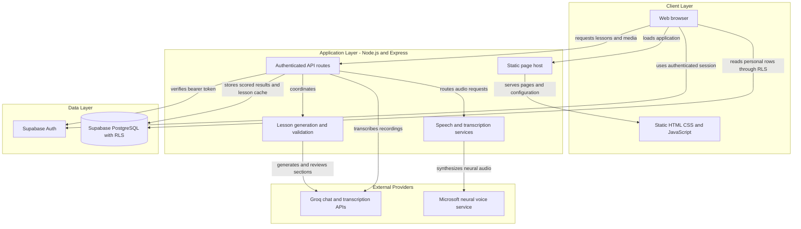
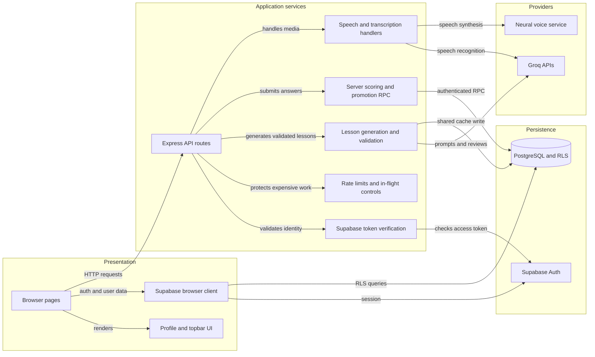

# Architecture Diagram

LinguaDomains is a browser-based language-learning application backed by a Node.js API and Supabase. The diagrams distinguish browser-facing pages, server-owned operations, persistent data, and external providers.

## Application Architecture

<!-- mermaid-checked: no \n, no em-dash/en-dash, no {} in labels, subgraphs are id["label"], arrows are -->|"label"|, all subgraphs closed by end, ids unique -->

### Technology Stack Summary

| Layer | Technology | Version | Purpose |
|---|---|---|---|
| Runtime | Node.js | `>=18` | Hosts the API and static pages |
| HTTP API | Express | `^4.19.2` declared | Authenticated lesson, scoring, cache, speech, and transcription routes |
| Browser | Native HTML, CSS, JavaScript modules | No build framework | Login, onboarding, dashboard, lessons, settings, and review |
| Browser data client | Supabase JavaScript SDK | `2.57.4` | Authentication and RLS-protected PostgREST access |
| Persistence | Supabase PostgreSQL | Managed service; server version not pinned here | Profiles, selections, lessons, progress, attempts, and vocabulary |
| Lesson and speech AI | Groq API | Configured model chain | Lesson sections, correctness review, and speech transcription |
| Neural text to speech | `msedge-tts` | `2.0.9` | Speech audio generation through the Microsoft voice service |
| Database tests | PGlite | `0.5.8` | Disposable local PostgreSQL-compatible migration and RPC checks |

### Data Storage & External Services

Supabase Auth issues browser sessions; Postgres RLS scopes personal data to the signed-in user. The browser uses the public anon key, while privileged shared-cache writes and scored submissions are handled by server endpoints and database RPCs. Groq provides lesson generation/review and Whisper transcription. Neural speech is generated through the `msedge-tts` library. Rate limits, in-flight work, and speech audio caching are currently process-local; there is no distributed queue or shared cache.

### Key Architectural Decisions

- Keep the frontend as static pages and native modules; use Express for authenticated operations and configuration delivery.
- Enforce authorization and sensitive write rules at both the API and Postgres/RLS boundary; never expose the service-role key to the browser.
- Validate generated lesson sections and correctness before shared caching; store personal lesson variants separately from shared lessons.

## Component Relationships

<!-- mermaid-checked: no \n, no em-dash/en-dash, no {} in labels, subgraphs are id["label"], arrows are -->|"label"|, all subgraphs closed by end, ids unique -->

### Component Inventory

| Component | Layer | Type | Responsibility |
|---|---|---|---|
| Browser pages | Presentation | Static routes | Collect learner input and render study flows |
| `supabase-client.js` | Presentation | Browser client module | Create one Supabase client and enforce session/sign-out flows |
| `supabase.js` | Presentation | UI/profile module | Read profiles, render topbar and show inline messages |
| Express API routes | Application services | HTTP endpoints | Authenticate and validate lesson, cache, scoring, speech, and transcription requests |
| Supabase token verification | Application services | Auth helper | Verify browser bearer tokens with Supabase Auth |
| Lesson generation and validation | Application services | Domain service | Prepare context, call Groq, validate sections, review, and merge lessons |
| Server scoring and promotion RPC | Application services | API and database function | Submit raw answers and persist server-calculated scores |
| Speech and transcription handlers | Application services | API and provider adapters | Validate audio/text, synthesize or transcribe, and enforce request bounds |
| Rate limits and in-flight controls | Application services | Middleware-like process state | Bound per-user requests and active generation work within one server process |
| Supabase Auth | Persistence boundary | Identity provider | Manage accounts and issue access tokens |
| PostgreSQL and RLS | Persistence | Relational database | Persist account-owned progress and shared lesson data |
| Groq APIs | Providers | External AI API | Generate/review lesson material and transcribe audio |
| Neural voice service | Providers | External speech service | Return neural text-to-speech audio |
